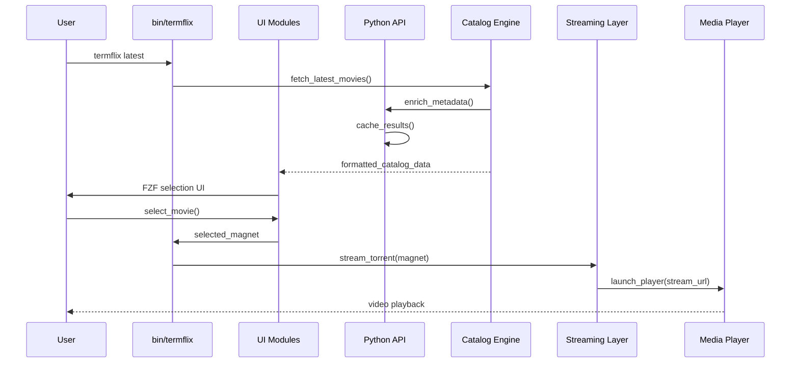

# Termflix Architecture Vision

## Executive Summary

Termflix is evolving from a Bash-first application to a hybrid architecture where Python handles data processing, API interactions, and business logic, while Bash retains control over terminal interaction, process management, and external tool orchestration.

## Current State (December 2025) ✅ **Milestones 1-3 Complete**

### Active Components
- **Bash Orchestration**: `bin/termflix` (535 lines) - Main CLI entry point
- **Core Modules**: colors, config, deps, logging (Bash)
- **UI Modules**: FZF integration, preview system, grid rendering (Bash)
- **Feature Modules**: search (relevance sorting), catalog, posters, torrent (Bash + Python backends)
- **Python Backends** (DEFAULT): 
  - `lib/termflix/scripts/catalog.py` (707 lines) - latest/trending/popular/shows/genre
  - `lib/termflix/scripts/api.py` (461 lines) - unified metadata (OMDB/TMDB/YTS)
  - `bin/scripts/group_results.py` (relevance scoring)
  - Legacy: `fetch_multi_source_catalog.py` (deprecated with warnings)

### Streaming Modules (Refactored)
- **`bin/modules/torrent.sh`** (1,552 lines, down from 1,748) - main orchestrator
- **`bin/modules/streaming/buffer_monitor.sh`** (205 lines) - buffer calculation & monitoring
- **`bin/modules/streaming/subtitle_manager.sh`** (174 lines) - subtitle detection & handling
- **`bin/modules/streaming/player.sh`** (268 lines) - player launch & monitoring with fork detection

### Completed Improvements
✅ **Search Results Sorting**: Relevance-based scoring (exact > starts-with > contains)  
✅ **Python Backends Default**: `USE_PYTHON_CATALOG=true`, `USE_PYTHON_API=true`  
✅ **Bash Wrapper Simplification**: omdb.sh reduced 41% (476 → 246 lines)  
✅ **Torrent.sh Decomposition**: 11% reduction (1,748 → 1,552 lines), 3 modules extracted  
✅ **Deprecation Warnings**: Legacy scripts self-document their deprecated status

## Target Architecture

```mermaid
graph TB
    subgraph "User Interface Layer"
        A[bin/termflix<br/>Main Entry Point<br/>Bash - 300 lines] --> B[UI Modules<br/>Bash - 800 lines]
        B --> C[FZF Integration<br/>Navigation & Selection]
        B --> D[Display System<br/>Grid & Previews]
        B --> E[Keyboard Handlers<br/>Shortcuts & Actions]
    end

    subgraph "Business Logic Layer"
        F[Core Modules<br/>Bash - 400 lines] --> G[Configuration<br/>Theme & Settings]
        F --> H[Dependency Management<br/>Tool Detection]
        F --> I[Logging & Debug<br/>Error Handling]

        J[Python Backends<br/>Python - 3000+ lines] --> K[Metadata API<br/>api.py]
        J --> L[Catalog Engine<br/>catalog.py]
        J --> M[Search System<br/>search_*.py + scraper]
        J --> N[Poster Management<br/>get_poster.py + cache]
    end

    subgraph "Streaming Layer"
        O[Stream Manager<br/>Bash - 200 lines] --> P[Player Factory<br/>player_factory.sh]
        O --> Q[Buffer Monitor<br/>buffer_monitor.sh]
        O --> R[Protocol Handlers<br/>local_file.sh, peerflix.sh]

        S[Future: Python Streaming<br/>Python - 1000 lines] --> T[Async Stream Manager]
        S --> U[Advanced Buffering]
        S --> V[Protocol Abstraction]
    end

    subgraph "External Tools"
        W[Terminal Tools<br/>FZF, Kitty, Viu]
        X[Media Players<br/>MPV, VLC, IINA]
        Y[Torrent Clients<br/>Transmission, WebTorrent]
        Z[Image Tools<br/>Chafa, Imagemagick]
    end

    A --> F
    A --> J
    A --> O

    C --> W
    D --> W
    D --> Z
    O --> X
    O --> Y
```



## Module Breakdown

### 1. User Interface Layer (Bash)

#### Main Entry Point: `bin/termflix`
**Purpose**: CLI parsing, routing, orchestration
**Size Target**: ~300 lines (currently 535)
**Responsibilities**:
- Command-line argument parsing
- Module loading and initialization
- Routing to appropriate handlers
- Signal handling and cleanup
- Environment setup

```bash
# Simplified structure
main() {
    parse_arguments "$@"
    setup_environment
    route_command "${args[0]}"
}
```

#### UI Modules
**Location**: `bin/modules/ui/`
**Size Target**: ~800 lines total
**Modules**:
- `fzf_catalog.sh` - FZF integration and options (~200 lines)
- `preview_fzf.sh` - Rich preview generation (~200 lines)
- `grid_layout.sh` - Grid geometry and positioning (~150 lines)
- `image_renderer.sh` - Image display abstraction (~150 lines)
- `keyboard_handlers.sh` - Keyboard shortcut management (~100 lines)

### 2. Business Logic Layer

#### Core Modules (Bash)
**Location**: `bin/modules/core/`
**Size Target**: ~400 lines total
**Modules**:
- `config.sh` - Configuration management (simplified to ~200 lines)
- `colors.sh` - Theme system (current 202 lines is good)
- `deps.sh` - Dependency checking (~150 lines)
- `logging.sh` - Logging utilities (~100 lines)

#### Python Backends
**Location**: `lib/termflix/scripts/`
**Size Target**: ~3000+ lines

##### Metadata API: `api.py` (1,733 bytes)
**Purpose**: Unified metadata client
**Features**:
- OMDB, TMDB, YTS integration
- Intelligent caching
- Rate limiting
- Fallback chain

```python
class TermflixAPI:
    def get_movie(self, imdb_id: str) -> MovieMetadata
    def get_show(self, tmdb_id: str) -> ShowMetadata
    def search(self, query: str) -> List[SearchResult]
    def get_poster(self, title: str, year: int = None) -> str
```

##### Catalog Engine: `catalog.py` (27,655 bytes)
**Purpose**: Content aggregation and management
**Features**:
- Multi-source fetching (YTS, TPB, EZTV)
- Genre mapping and filtering
- Caching layer
- Enrichment pipeline

```python
class CatalogFetcher:
    def get_latest_movies(self, limit: int = 50) -> List[CatalogItem]
    def get_trending_movies(self, limit: int = 50) -> List[CatalogItem]
    def get_by_genre(self, genre: str) -> List[CatalogItem]
    def search_catalog(self, query: str) -> List[CatalogItem]
```

##### Search System
**Components**:
- `search_*.py` - Site-specific searchers (~2,000 lines total)
- `generic_torrent_scraper.py` - Shared scraper logic (8,187 bytes)
- `group_results.py` - Result deduplication (399 lines)
- `search_extra_torrents.py` - Extended search (4,422 bytes)

##### Poster Management
**Components**:
- `get_poster.py` - Poster fetching with fallback (8,086 bytes)
- `poster_cache.py` - Advanced caching and pre-rendering (14,705 bytes)

### 3. Streaming Layer

#### Current State (Bash)
**Problem**: `torrent.sh` is 1,747 lines - needs breakup

#### Target Structure
```
bin/modules/streaming/
├── core/
│   ├── stream_manager.sh      # 200 lines
│   ├── buffer_monitor.sh      # 150 lines
│   └── video_detector.sh      # 100 lines
├── players/
│   ├── player_factory.sh      # 100 lines
│   ├── vlc_handler.sh         # 100 lines
│   ├── mpv_handler.sh         # 100 lines
│   └── iina_handler.sh        # 100 lines
└── protocols/
    ├── local_file.sh          # 100 lines
    └── peerflix_stream.sh     # 200 lines
```

#### Future: Python Streaming
**Location**: `lib/termflix/streaming/`
**Size Target**: ~1000 lines
**Features**:
- Async streaming with `aiohttp`
- Smart buffering algorithms
- Protocol abstraction
- Advanced subtitle handling

```python
class StreamManager:
    async def start_stream(self, magnet: str, options: StreamOptions)
    async def get_buffer_status(self) -> BufferStatus
    async def select_quality(self, available: List[Quality]) -> Quality
```

## Data Flow Architecture



## Configuration Architecture

### Configuration Hierarchy
1. **Defaults**: Hardcoded in modules
2. **System Config**: `/etc/termflix/config`
3. **User Config**: `~/.config/termflix/config`
4. **Env Vars**: Runtime overrides
5. **CLI Args**: Session overrides

### Feature Flags
```bash
# Python backends (DEFAULT: ENABLED as of Dec 2025)
USE_PYTHON_CATALOG=${USE_PYTHON_CATALOG:-true}   # ✅ Promoted to default
USE_PYTHON_API=${USE_PYTHON_API:-true}           # ✅ Promoted to default
USE_PYTHON_STREAMING=${USE_PYTHON_STREAMING:-false}  # Future (Priority 4)

# UI preferences
USE_GRID_VIEW=${USE_GRID_VIEW:-true}
USE_FANCY_PREVIEW=${USE_FANCY_PREVIEW:-true}
POSTER_CACHE_SIZE=${POSTER_CACHE_SIZE:-1000}
```

## Dependency Management

### External Tool Dependencies
```yaml
required:
  - fzf          # Fuzzy finding
  - curl         # HTTP requests
  - jq           # JSON parsing
  - transmission # Torrent client

optional:
  players:
    - mpv        # Media player (recommended)
    - vlc        # Alternative media player
    - iina       # macOS player

  image_display:
    - kitty      # Terminal with image support
    - viu        # Terminal image viewer
    - chafa      # ASCII art generator
    - imgcat     # iTerm2 image tool

  python:
    - python3    # Python 3.9+
    - pip3       # Package manager
```

### Python Dependencies
```python
# requirements.txt
aiohttp>=3.8.0          # Async HTTP
pydantic>=1.10.0        # Data validation
click>=8.0.0            # CLI framework
rich>=12.0.0            # Terminal formatting
Pillow>=9.0.0           # Image processing
aiofiles>=0.8.0         # Async file I/O
```

## Performance Optimizations

### 1. Caching Strategy
- **Metadata Cache**: `~/.cache/termflix/metadata/` (30 days TTL)
- **Poster Cache**: `~/.cache/termflix/posters/` (90 days TTL)
- **Catalog Cache**: `~/.cache/termflix/catalog/` (24 hours TTL)
- **Search Cache**: `~/.cache/termflix/search/` (7 days TTL)

### 2. Async Operations
- Parallel poster fetching
- Concurrent API calls
- Background pre-rendering
- Progressive catalog loading

### 3. Lazy Loading
- Load posters on-demand
- Stream UI components
- Deferred metadata fetching

## Security Considerations

### 1. API Key Management
- Environment variables for sensitive keys
- Config file encryption option
- Key rotation support

### 2. Network Security
- SSL verification options
- Proxy support
- Rate limiting

### 3. Input Validation
- Sanitize all user inputs
- Validate magnet links
- Check file permissions

## Testing Strategy

### 1. Unit Tests (Python)
```bash
# Run with: pytest
tests/
├── test_api.py
├── test_catalog.py
├── test_search.py
└── test_streaming.py
```

### 2. Integration Tests (Bash)
```bash
# Run with: bats
tests/integration/
├── test_cli.bats
├── test_ui.bats
└── test_streaming.bats
```

### 3. End-to-End Tests
```bash
# Test scenarios
- termflix latest
- termflix search "query"
- termflix <magnet_link>
- Navigation shortcuts
- Player selection
```


## Success Metrics

### Code Quality
- **Module Size**: No module > 500 lines (except main entry)
- **Python Coverage**: 80% of data processing in Python
- **Test Coverage**: 90%+ for Python, 70%+ for Bash

### Performance
- **Startup Time**: < 2 seconds
- **Catalog Load**: < 3 seconds for 50 items
- **Search Response**: < 5 seconds
- **Poster Display**: < 1 second cached, < 3 seconds uncached

### User Experience
- **No Regressions**: All existing features work
- **Improved Feedback**: Better error messages and progress indicators
- **Customization**: Theme and layout options
- **Documentation**: Complete API docs

## Future Enhancements

### 1. Plugin System
```python
# termflix/plugins/
class SearchPlugin:
    def search(self, query: str) -> List[Result]

class PlayerPlugin:
    def play(self, url: str, options: dict)
```

### 2. TUI Mode
- Full-screen terminal UI
- Keyboard navigation
- Real-time updates
- Mini-player mode

### 3. Remote Control
- Web interface
- Mobile app companion
- API for third-party tools
- Cast to devices

### 4. AI Features
- Content recommendations
- Smart quality selection
- Automated subtitle download
- Content ratings and reviews

## Conclusion

This architecture balances the strengths of both Bash and Python:
- **Bash**: Terminal interaction, process management, external tools
- **Python**: Data processing, API interactions, business logic

The modular design ensures maintainability, testability, and extensibility while preserving the user experience that makes Termflix effective.

The phased migration approach minimizes risk while delivering immediate benefits, with clear metrics and milestones to track progress.