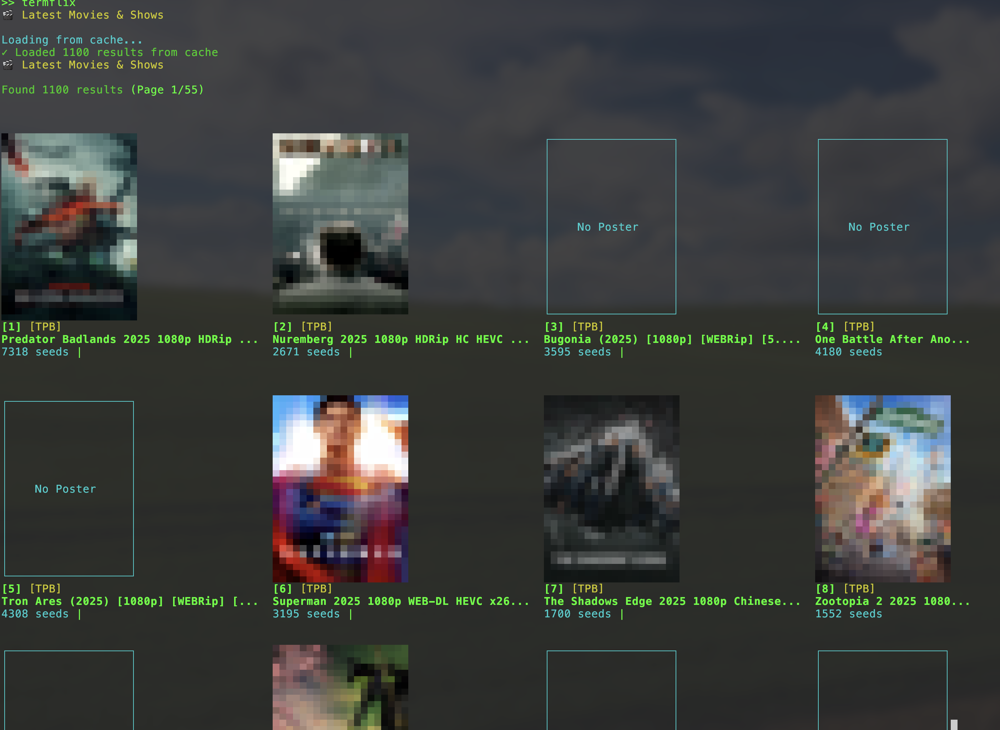
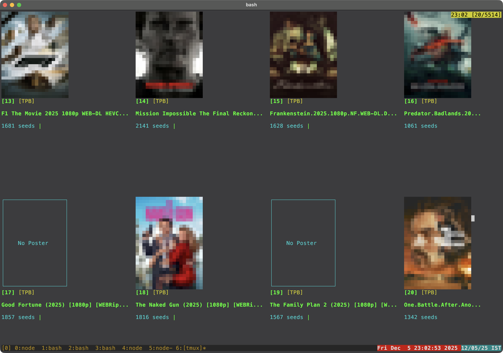
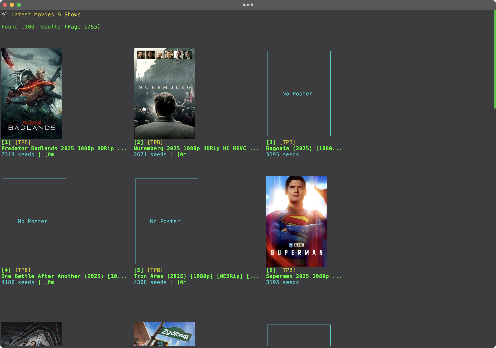
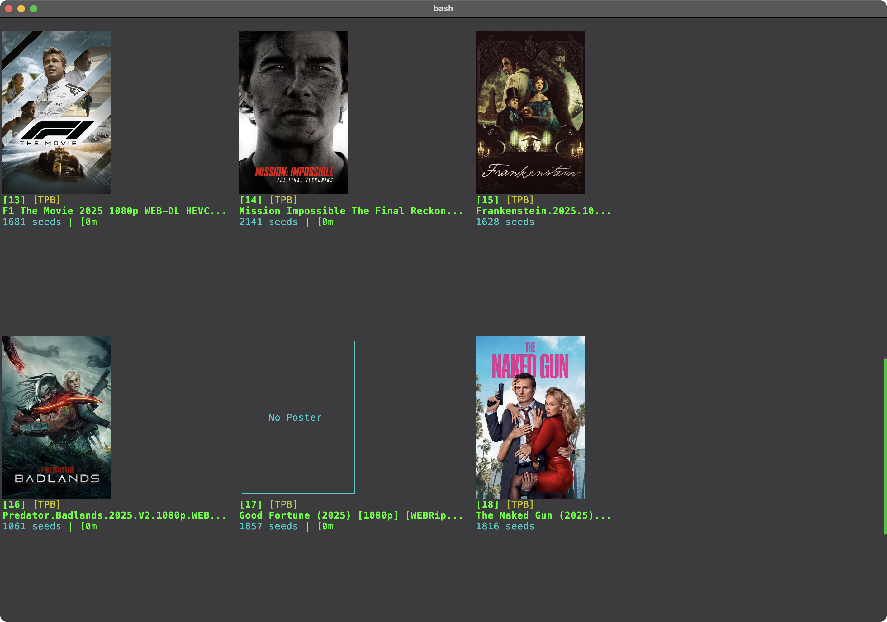
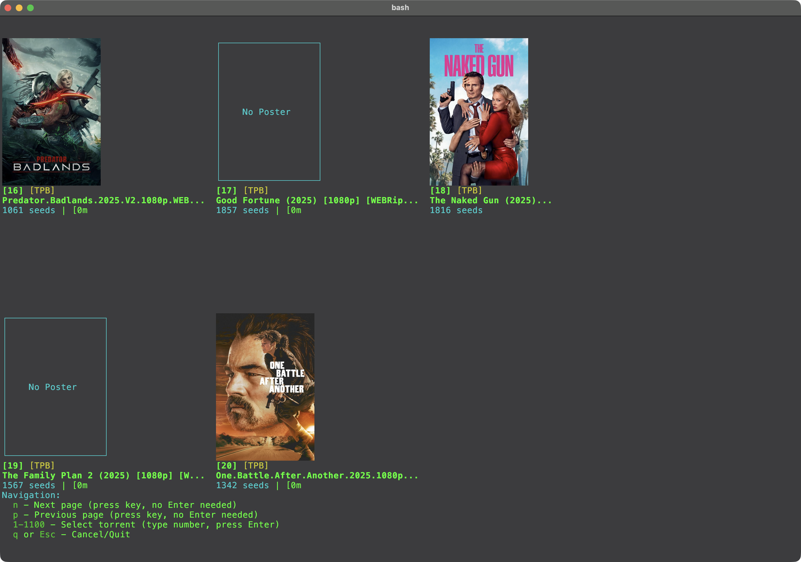
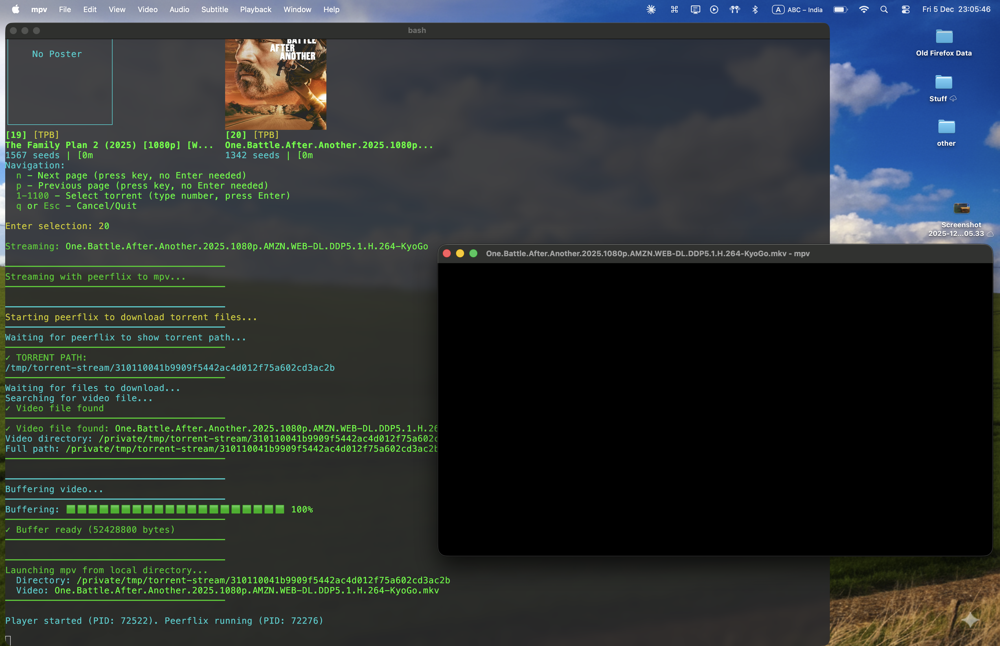

# Termflix 🎬

A powerful terminal-based torrent streaming tool that lets you browse and stream movies and TV shows directly from your terminal.


## Features

- 🎥 **Browse Latest Movies & Shows** - Browse trending and popular content
- 🔍 **Search Torrents** - Search across multiple torrent sites (YTS, YTSRS, TPB, EZTV, 1337x)
- 🎬 **Movie Posters** - View movie posters in your terminal (requires `viu` or Kitty terminal)
- 📺 **Stream to mpv/vlc** - Stream torrents directly to your favorite media player
- 🔄 **Smart Fallback** - Automatically falls back to `transmission-cli` when `peerflix` fails
- 💾 **8-Hour Caching** - Caches catalog results for faster browsing
- 🎯 **TMDB Integration** - Uses TheMovieDB API for accurate movie metadata and posters
- 🎞️ **Subtitle Support** - Automatically finds and loads subtitle files

## Installation

### Quick Install

```bash
# Download and install
curl -fsSL https://raw.githubusercontent.com/metacritical/termflix/main/install.sh | bash

# Or manually
git clone https://github.com/metacritical/termflix.git
cd termflix
./install.sh
```

### Dependencies

**Required:**
- `bash` (4.0+)
- `jq` - JSON parser for API responses
- `peerflix` or `webtorrent-cli` - Torrent streaming
- `mpv` or `vlc` - Media player

**Optional:**
- `transmission-cli` - Fallback for problematic magnet links
- `python3` - For YTSRS search (web crawling)
- `viu` - Display movie posters in terminal (works on all platforms)
- `kitty` terminal - Native image support (better quality than viu)

### Install Dependencies

**macOS:**
```bash
brew install jq peerflix mpv transmission-cli python3
# Optional: brew install viu
```

**Linux (Debian/Ubuntu):**
```bash
sudo apt-get update
sudo apt-get install jq mpv transmission-cli python3
npm install -g peerflix
# Optional: cargo install viu
```

**Linux (RHEL/CentOS):**
```bash
sudo yum install jq mpv transmission-cli python3
npm install -g peerflix
# Optional: cargo install viu
```

## Configuration

### First Run Setup

On first run, termflix will:
1. Ask for your preferred media player (mpv or vlc)
2. Create `~/.config/termflix/config` with your preferences
3. Create cache directory at `~/.config/termflix/cache/`

### TMDB API Setup (Optional but Recommended)

For movie posters and metadata, get a free API key from [TheMovieDB](https://www.themoviedb.org/settings/api):

1. Sign up at [themoviedb.org](https://www.themoviedb.org)
2. Go to Settings → API
3. Request an API key (free)
4. Get a Read Access Token (also free)

Add to `~/.config/termflix/config`:
```bash
TMDB_API_KEY=your_api_key_here
TMDB_READ_TOKEN=your_read_token_here
```

## Usage

### Browse Latest Content



Browse the latest movies and TV shows with movie posters displayed in your terminal.
```bash
termflix                    # Shows latest movies and shows
termflix latest movies      # Latest movies only
termflix latest shows       # Latest TV shows only
termflix trending all       # Trending content
termflix popular all        # Popular content
```

### Search
```bash
termflix search "movie name"
termflix search "Superman 2025"
```

### Stream from Magnet Link
```bash
termflix "magnet:?xt=urn:btih:..."
```

### Stream from Torrent File
```bash
termflix movie.torrent
```

### Options
```bash
termflix --help            # Show help
termflix --list            # List files in torrent
termflix -i 2              # Select specific file by index
termflix -s                # Enable subtitles
termflix player mpv        # Set default player to mpv
```

## Navigation



When browsing the catalog:
- **n** - Next page (press key, no Enter needed)
- **p** - Previous page (press key, no Enter needed)
- **1-1100** - Select torrent (type number, press Enter)
- **q** or **Esc** - Cancel/Quit



## How It Works

1. **Catalog Browsing**: Fetches latest/trending content from multiple sources

   

2. **Caching**: Results are cached for 8 hours to reduce API calls
3. **Streaming**: Uses `peerflix` for streaming, falls back to `transmission-cli` if needed

   

4. **Posters**: Downloads and caches movie posters from TMDB
5. **Player Integration**: Launches mpv/vlc with video and subtitle files

   

6. **Return to Catalog**: After playback, returns to the catalog view

   

## Troubleshooting

### No movie posters showing
- Install `viu`: `cargo install viu` or `brew install viu`
- Or use Kitty terminal: `sudo apt install kitty` (Linux) or `brew install kitty` (macOS)

### Peerflix fails with some magnet links
- Install `transmission-cli` - termflix will automatically use it as fallback
- `brew install transmission-cli` (macOS)
- `sudo apt-get install transmission-cli` (Linux)

### Search not working
- Ensure `python3` is installed
- Check internet connection
- Some APIs may be temporarily unavailable

### jq not found
- Install jq: `brew install jq` (macOS) or `sudo apt-get install jq` (Linux)

## License

MIT License - feel free to use and modify as needed.

## Contributing

Contributions welcome! Please open an issue or pull request.

## Credits

- Uses [TheMovieDB API](https://www.themoviedb.org/) for movie metadata
- Torrent sources: YTS, YTSRS, The Pirate Bay, EZTV, 1337x
- Built with bash, jq, and lots of ❤️
