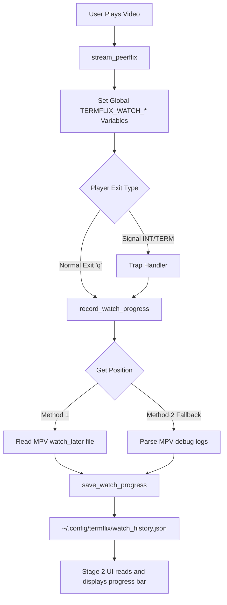

# Termflix Watch History - Technical Documentation

## Overview

The Watch History feature tracks playback progress for streamed torrents, enabling users to resume watching and see visual progress indicators in the UI.

---

## Architecture



---

## Design Decisions

### 1. Torrent Hash as Primary Key
**Decision:** Use the magnet link's `btih` hash (e.g., `d4b52cdea...`) as the unique identifier for watch history entries.

**Rationale:** 
- Peerflix uses dynamic localhost ports (e.g., `http://localhost:63628/`)
- MPV's native `watch_later` uses URL hash, which changes every session
- Torrent hash is **constant** across sessions

### 2. Dual-Method Position Extraction
**Decision:** Implement two methods for extracting playback position:

| Method | Source | Reliability |
|--------|--------|-------------|
| **Method 1** | MPV's `watch_later` config file | Low (often fails for HTTP streams) |
| **Method 2** | Parse MPV debug log for `AV: HH:MM:SS` | High (always available) |

**Rationale:** MPV refuses to create `watch_later` files for HTTP streams on macOS. Method 2 is the fail-safe.

### 3. Unified `record_watch_progress()` Function
**Decision:** Single function called from BOTH normal exit and signal handlers.

**Rationale:** Codex analysis revealed the original implementation had two separate code paths (signal vs normal exit) with different behavior. Unified function ensures consistency.

### 4. Global Variables for Cross-Scope Access
**Decision:** Use global `TERMFLIX_WATCH_*` variables instead of local function variables.

**Rationale:** 
- Signal handlers (traps) cannot access local variables from other functions
- Bash 3.2 (macOS default) doesn't support `declare -g`
- Simple top-level assignment is global by default

---

## What Failed (Lessons Learned)

### Failure 1: MPV `watch_later` Files Never Created
**Symptom:** `~/.config/termflix/watch_later/` directory remained empty.

**Root Cause:** MPV doesn't create state files for HTTP streams (like `http://localhost:PORT/`).

**Solution:** Implemented Method 2 (log parsing fallback).

---

### Failure 2: Code Worked on Signals Only
**Symptom:** Watch history saved when pressing Ctrl+C, but NOT when pressing 'q' to quit.

**Root Cause:** The cleanup logic was only in the `trap` handler, not the normal exit path.

**Solution:** Created unified `record_watch_progress()` called from BOTH paths.

---

### Failure 3: `declare -g` Not Supported
**Symptom:** `declare: -g: invalid option` on macOS.

**Root Cause:** macOS ships with Bash 3.2; `declare -g` requires Bash 4.2+.

**Solution:** Replaced with simple variable assignments at script level.

---

### Failure 4: Trap Persisted After Function Return
**Symptom:** Stale trap handler with undefined variables could fire later.

**Root Cause:** Trap was never cleared after `stream_peerflix()` returned.

**Solution:** Added `trap - INT TERM` before return statement.

---

### Failure 5: Edits Not Persisted to Disk
**Symptom:** Code changes visible in terminal but not in `git diff`.

**Root Cause:** Unknown (possible IDE caching or shell memory state).

**Solution:** Git status monitoring; complete reimplementation.

---

## Files & Functions

### [watch_history.sh](file:///Users/pankajdoharey/Development/termflix/modules/watch_history.sh)
Core watch history module.

| Function | Purpose |
|----------|---------|
| `init_watch_history()` | Creates directory and empty JSON if missing |
| `extract_torrent_hash()` | Extracts `btih` hash from magnet link |
| `save_watch_progress()` | Writes entry to `watch_history.json` |
| `get_watch_position()` | Returns last position in seconds |
| `get_watch_percentage()` | Returns percentage (0-100) |
| `generate_progress_bar()` | Returns styled progress bar string |

---

### [torrent.sh](file:///Users/pankajdoharey/Development/termflix/modules/torrent.sh)
Streaming module with watch history integration.

| Location | Element | Purpose |
|----------|---------|---------|
| Lines 25-34 | Global Variables | `TERMFLIX_WATCH_*` for cross-scope access |
| Lines 37-137 | `record_watch_progress()` | Unified position extraction + save |
| Lines 429-443 | Variable Setup | Sets globals at stream start |
| Line 1683 | Trap Handler | Calls `record_watch_progress()` on signal |
| Line 1699 | Normal Exit | Calls `record_watch_progress()` on quit |
| Line 1705 | Trap Cleanup | `trap - INT TERM` prevents stale handlers |

---

### [fzf_catalog.sh](file:///Users/pankajdoharey/Development/termflix/modules/ui/fzf_catalog.sh)
Stage 2 UI with progress bar display.

| Location | Element | Purpose |
|----------|---------|---------|
| Lines 326-328 | Source Module | Sources `watch_history.sh` |
| Lines 359-370 | Hash Extraction | Gets torrent hash from magnet |
| Lines 364-368 | Progress Check | Calls `get_watch_percentage()` |
| Line 373 | Display Format | Appends progress bar to version line |

---

## UI Design

### Progress Bar Location
**Stage 2 (Version Picker)** — Each torrent version shows its own progress inline.

### Progress Bar Design
```
━━━━━━━━━━━━━━━━━━━━━━━━──────── 80%
```

| Element | Character | Color |
|---------|-----------|-------|
| Filled | `━` (heavy line) | Pink (#E879F9) |
| Empty | `─` (light line) | Gray (#303030) |
| Percentage | `80%` | White |

### Visual Example
```
▶ 🧲 [YTS] 1080p - 2.6GB - 👥 100 seeds - YTS.mx| ━━━━━━━━━━━━━━━━━━━━━━━━──────── 80%
  🧲 [TPB] 720p - 1.4GB - 👥 50 seeds - ThePirateBay|
```

---

## Data Storage

### File: `~/.config/termflix/watch_history.json`

```json
{
  "d4b52cdea22a20c88a3b5e424c6f19acf3ce65a6": {
    "title": "Wildcat.2025.720p.WEBRip.x264.AAC-[YTS.LT].mp4",
    "last_position": 33,
    "duration": 8185,
    "percentage": 0,
    "quality": "720p",
    "size": "unknown",
    "last_watched": "2025-12-19T14:18:13Z",
    "completed": false
  }
}
```

### Debug Log: `/tmp/termflix_history_debug.log`

Contains detailed execution trace for debugging:
- Timestamp
- Source magnet
- Stream URL
- Watch directory contents
- Method used (1 or 2)
- Position/Duration parsed
- Save status

---

## Verification

### Test Procedure
1. Run `./bin/termflix`
2. Play any video for 10+ seconds
3. Press **'q'** to quit normally
4. Check: `cat /tmp/termflix_history_debug.log | tail -20`
5. Verify: `cat ~/.config/termflix/watch_history.json`
6. Re-enter Stage 2 — progress bar should be visible

### Expected Log Output
```
--- Recording Watch Progress at Fri Dec 19 22:45:00 IST 2025 ---
Source: magnet:?xt=urn:btih:d4b52c...
Watch file not found (Trying Method 2)
Log Last AV: AV: 00:05:20 / 01:30:00
Method 2 - Log Position: 320
Method 2 - Log Duration: 5400
SAVED: 5% for hash d4b52c...
```
